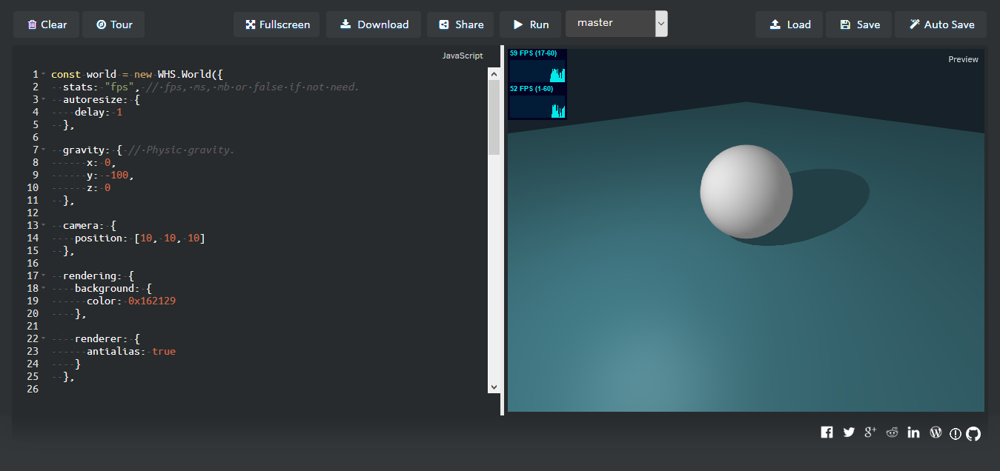

## Playground
###### :computer: Playground to play with Whitestorm.js right into your browser

### :computer: :link: [Playground](http://playground.whsjs.io/)

-------------

## Features
- Have fun, play around with [Whitestormjs](https://github.com/WhitestormJS) without going through hassle of setting stuff up.
- Write code, run, preview in full screen, download code as HTML
- Examples to play around in playground
- Save/auto-save your code
- Share your code with others
- Take a tour to see how stuff works
- Toggle between library versions with a click of a button

-------------------------------------

##  Screenshots

--------------------------------------------------
Inspired and Inherited from [CloudEdit](https://github.com/TheInsomniac/CloudEdit)
